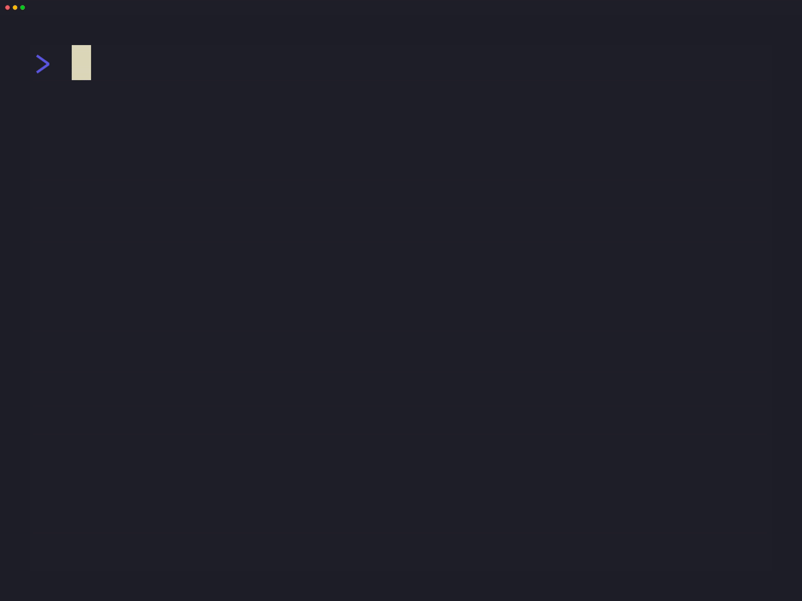

# Nitch Clone

<!--toc:start-->

- [Nitch Clone](#nitch-clone)
  - [Key differences from nitch](#key-differences-from-nitch)
  - [Dependencies](#dependencies)
  - [Building and running](#building-and-running)
  <!--toc:end-->

## 

---

This program is inspired by
[nitch](https://github.com/ssleert/nitch) but written in Go.

## Key Differences from nitch

- Written in Go
- Consistent (and different) icons
- No word art (yet)
- Themes
- Customizable

## Dependencies

This program requires `go` to build.

## Config and Themes

Themes can be set through `config.toml`
placed in `$XDG_HOME/nitch-clone`
(It will be`~/.config/nitch-clone/config.toml` for most users).

Run `nitch-clone -h` to see available options.
The default options are set through your config and you can override
them with cli flags.

Currently 10 themes are available

- catppuccin-mocha
- catppuccin-frappe
- catppuccin-latte
- catppuccin-macchiato
- grayscale
- classic
- high-intensity
- kanagawa-wave
- kanagawa-lotus
- kanagawa-dragon

The dots and border color can be set
independently of the theme.

## Building and Running

> [!NOTE]
> For building `go` must be installed.
> This has only been tested on EndeavourOS, ArchLinux,
> Ubuntu, Fedora and Debian.

1. Clone this [repository](https://github.com/sid314/nitch-clone).
2. Run `cd nitch-clone`
3. Run `go build`
4. Run `./nitch-clone` or add it to your path or copy it to `/usr/local/bin/`

---

or simply run `go install github.com/sid314/nitch-clone@latest`

---
